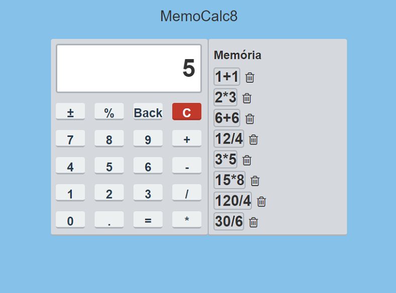

# Introdução

Esse aplicativo tem a finalidade de realizar cálculos básicos de matemática e salvar durante a sua utilização as últimas 8 operações (as mesmas também podem ser excluídas a qualquer momento).

# Features

O app foi criado com a utilização das seguintes ferramentas:

- Bootstrap;
- React;
- Redux;
- Webpack

# Execução

No diretória de sua escolha siga os seguintes passos:

- git clone https://github.com/LuizHonorato/memo-calc-8.git
- npm i
- npm run dev

# Screenshots

